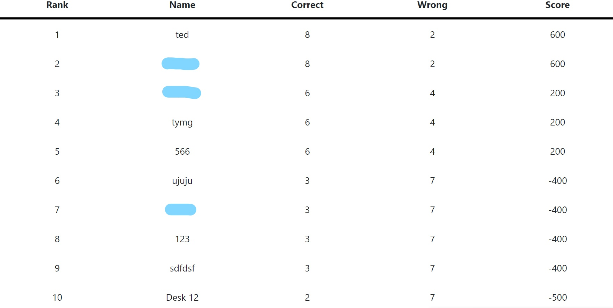
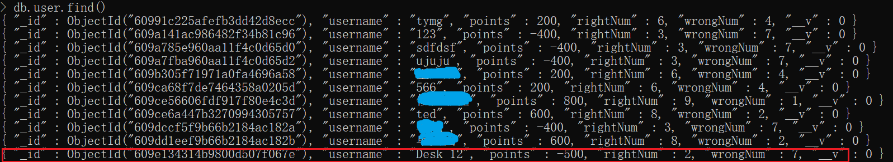
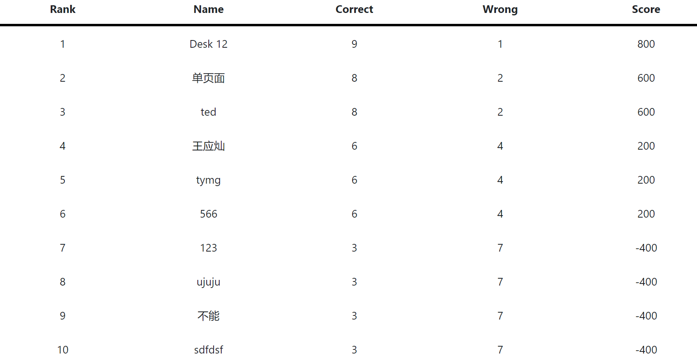
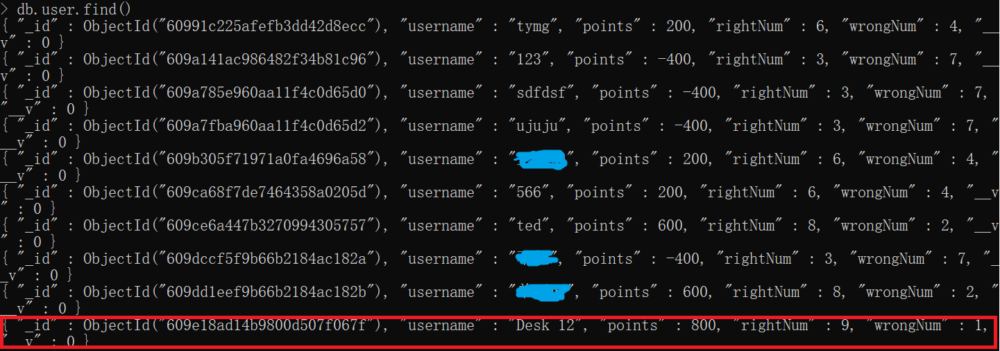

## Design Evaluation

### Reasons Evaluation

Nowadays, the theme of waste separation is a hot topic under the theme of environmental protection. In order to vigorously promote waste separation, in recent years, various city municipalities have put waste separation into practice. But it must be said that its impact on our lives cannot be ignored. If you don't know how to separate garbage, you can expect the garbage cans next to your house to be piled up with garbage. The reason is that no refuse collector will pick up mis-sorted garbage. We chose this topic in order to make it more likely that the garbage will be collected instead of us putting it out.


### Paper Prototyping

Because we chose this topic in no way for any environmental protection issues, but just for the convenience of our own lives. Then the project we do must be simple and easy to implement, and the purpose must be clear. And everyone could participate and learn. So our prototype is more functional while still being fun. We set up the interface before the sorting game to allow users to learn the rules of garbage sorting. Of course, the average user will not read boring documents at the beginning. But when they get frustrated in the game, we still set up a button to jump to the next level, so that they can learn about garbage sorting.


### About Our Philosophy 

We adhered to the concept of simplifying and unifying the page, and made the single page project as simple as possible, changing the configuration of many components before and after. Finally the number of components was kept to a minimum, and the interface was made more uniform and optimized through front-end component control.


## Unit Testing


In unit testing blocks, we prepared to test all of components in our project. Our components consists of components listed below: 

- about

- bar

- black-box

- blue-box

- brown-box

- green-box

- home-bar 

- card

- contact

- game

- home

- information 

- login

- point

- ranking

- result

  

Each component has a big role in the project, but many of them are very similar to each other. Our initial idea was to test each component separately, but some similar components with very little back-end logic were combined with other components, such as black-box, and we tested the entire project flow in a purposeful way to determine the performance of the core components in the project and reduce bugs.


### Critical Testing

We have done a lot of testing, including the testing of the ranking and result components is very effective, there are some unexpected errors in the test and we have optimized the components and interfaces to avoid these bugs, the following are some of the records：

#### Test 1

We want to check that the leaderboard can still be updated after the user has finished the game for the same username entered, to avoid the situation where there is no way to overwrite the previous information and the occurrence of duplicate data entry.

- There is one record in the database for the user "Desk 12"：{ "_id" : ObjectId("609e134314b9800d507f067e"), "username" : "Desk 12", "points" : -500, "rightNum" : 2, "wrongNum" : 7, "__v" : 0 }
- This user is in the ranking
- Play the game again with this username and make the score different from the last time


In the initial test, it was found that the leaderboard data could not be updated, and it was even found that the data was not inserted into the database. 






In the code calling the interface method, we found that the logic to determine the duplicate was missing. After making code changes, the game records were successfully updated to the database.







The previous code：


```ts
create() {
    if(this.People.username) {
          this.userService.create(this.People).subscribe(result => {
            console.log('result is ', result);
          });
    });
```


Changed code：


```ts
create() {
    this.http.get('/api/user/query').subscribe((result: any) => {

      for (var _i = 0; _i < result.data.length; _i++) {

        if(JSON.stringify(result.data[_i]['username'])
           .substring(1,this.checkStringLength(
            JSON.stringify(result.data[_i]['username']))-1) === this.People.username){
          this.userService.remove(this.People).subscribe(result => {
            console.log('result is ', result);
          })
        };
      }
        if(this.People.username) {
          this.userService.create(this.People).subscribe(result => {
            console.log('result is ', result);
          });
        } 
    });
```


#### Test 2

We want to detect that for usernames defined in different languages, users can still continue playing the game and get their ranking.

- Set the username to Chinese:  过!
- Play with this username

The test was found to pass successfully.

#### User Testing

Our user testing is mainly based on the feedback of two users. Both of them are students from Bristol. We hope to get feedback and help through their experience of the game. We also provide feedback channels in our game, and we can be contacted through email.

User 1 
He is a 26 year old student. In the process of the game, he thinks that the game is more difficult, because he can't do a good job of rubbish classification.
User 2
He is a 23-year-old student. In the process of the game, most of the rubbish classification is correct, but there is a situation that she does not know how many questions she has answered correctly.
Therefore, in order to solve these problems, we introduced the details of rubbish classification in the process of the game, which is from the official website of the British government. In this way, it tells users how to classify rubbish. In addition, we show the current points of users, and give the ranking, to improve the fun and enthusiasm of users to participate in the game.
