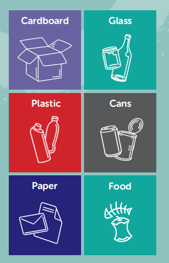
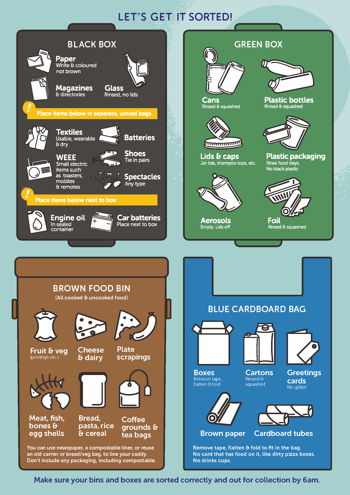

# 布里斯托垃圾分类规则

### **Household waste (business waste on the opposite)**（英国垃圾分类）

**Recycling waste**: cardboard, glass, plastic, cans, paper and food

**General waste**: other waste

**垃圾**分为：**生活垃圾**和**商业活动产生的垃圾**，但商业活动产生垃圾需要专门负责人去联系垃圾站进行定期清理，并不属于人们正常生活中能接触到的垃圾。**生活垃圾**分为：**可回收垃圾**和**不可回收垃圾**，可回收的有6类，如下。

### **Kerbside Recycling System in Bristol（布里斯托路边回收系统）**

 

#### **1.** **Black recycling box**

***// in box*** 

Paper 

Magazines

Glass 

普通的纸、杂志和玻璃（放在box里）

***// in separate, untied bags*** 

Usable and dry textiles

Batteries

Shoes (tied in pairs)

Small electronic items such as toasters, mobile phones and remote controls

Spectacles 

电池、可用且干的纺织品、眼镜和小的电子设备（拿没封口的袋子单放）

***// next to the boxes*** 

Engine oil (in a sealed container)

Car batteries

机油（密封容器装的）和汽车电池放在box旁边

 

#### **2.** **Green recycling box**

Cans 罐头

Plastic bottles 塑料瓶

Lids and caps 盖子

Plastic packaging (no black plastic) 塑料包装袋（除黑色）

Aerosols (empty, no lids) 气溶胶瓶（没有盖子，空的）

Foil 包装箔

能挤扁的都挤扁再放

 

#### **3.** **Brown food waste bin**

Leftover cooked food and uncooked food (newspaper, compostable liner or plastic to line food waste caddy) 剩饭和没用过的食材

Fruit and vegetable 水果蔬菜

Cheese and dairy 奶酪和其他乳制品

Meat,fish and bones 鱼、肉和骨头

Bread, pasta, rice and cereal 面包片、米饭和谷物

Coffee grounds and tea bags 咖啡渣和泡茶袋

 

#### **4.** **Blue boxes**

Boxes (no tape) 没有胶带包裹的盒子

Cartons (rinsed and squashed) 纸箱子（需要压扁）

Greetings card (no glitter) 贺卡（不能有金纸等装饰）

Brown paper 牛皮纸

Cardboard tubes 纸板管（？？）

 

#### **5.** **Non- recycling green bins**

信息来源于**https://bristolwastecompany.co.uk/**